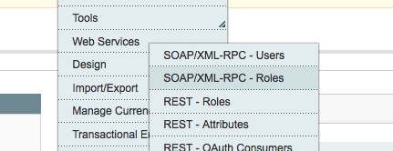
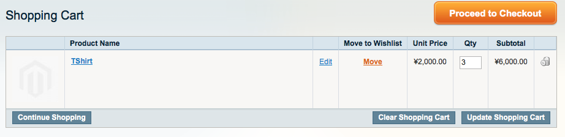

# Proof of concept

## Goal
This is a proof of concept to update the Magento cart of a user with products using the Magento API.

## Requirements

This requires node and npm on the classpath.
Install the dependencies with:

`
npm install
`

Check you have all properly install with:

`
node app.js
`

This should return the usage message:

`
Usage: <add|remove|update> <cartId> <product_id> <qty>
`
## Settings

You need to setup a user for the API. This is located in the System-> Web Services section of the admin interface.

API Endpoint and user login are stored in the file **config.json**.

`
{
	"api_endpoint": "http://magento2/api/v2_soap?wsdl=1",
	"username":"nico2",
	"apiKey": "123456"
}
`

Replace this with values that work for you.

The cartId for a user can be found using the following code from PHP:

`
 Mage::getSingleton(’checkout/session’)->getQuoteId() 
`
This is take from [magento FAQ](http://www.magentocommerce.com/boards/viewthread/26621/).

## Try it

### Add items to a user's cart

We add items to cart with id 9, product id is 1, and a quantity of 3.

`
 node app.js add 9 1 3
`

### Update the quantities

`
 node app.js update 9 1 7 
`

We update the quantity of that item to 7 in the cart.

### Remove a product
The below will clear the product with id 1 from cart with id 9

`
 node app.js remove 9 1
`
